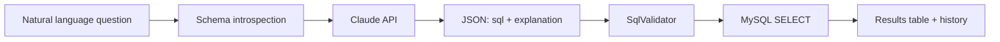

# Text to SQL AI

Ask questions about your data in plain English and get back runnable SQL plus a result table — powered by **Claude** and a realistic **e-commerce demo database**.

**Live demo:** [text-to-sql-ai.on-forge.com](https://text-to-sql-ai.on-forge.com)

---

## What it does

You type a question like *“Which categories have more than five products?”* The app:

1. **Introspects** the MySQL schema (tables, columns, foreign keys, and sample rows) while hiding framework tables and system schemas.
2. **Sends** that context and your question to the Anthropic Messages API.
3. **Parses** a structured JSON response with the generated `SELECT` and a short explanation.
4. **Validates** the SQL server-side (read-only, single statement, schema allowlist, row cap).
5. **Runs** the query and renders the rows in the browser.

Earlier questions are stored so you can reopen SQL and cached results from the sidebar without calling the model again. Submitting again for the same history entry updates that record in place.




---

## Tech stack


| Layer    | Choices                                             |
| -------- | --------------------------------------------------- |
| Backend  | PHP 8.3, Laravel 13                                 |
| AI       | Anthropic Claude (Messages API)                     |
| Database | MySQL 8                                             |
| Frontend | Blade, Tailwind CSS 4, DaisyUI, Vite, jQuery (AJAX) |


---

## Demo database

The **tech store** schema models a small online electronics shop:


| Area    | Tables                                                                                                                        |
| ------- | ----------------------------------------------------------------------------------------------------------------------------- |
| Catalog | `product_categories`, `products`, `attributes`, `attribute_options`, `product_category_attribute`, `product_attribute_option` |
| Sales   | `customers`, `orders`, `order_products`                                                                                       |


Categories cover laptops, smartphones, tablets, and related product types, with optional attributes (brand, RAM, storage, and so on) linked to products and orders.

The `questions` table holds query history for the UI; it is excluded from schema introspection so the model never sees it.

---

## Example questions

Try prompts like these against the demo store:

- Top 5 products by total order amount
- Products that have never been ordered
- Monthly revenue for the last 12 months
- Categories with more than 2 products

Suggestion chips on the home page come from `config/ai.php`.

---

## Safety and limits

Generated SQL passes through `SqlValidator` before execution:

- Only a single `SELECT` or `WITH … SELECT` statement
- Blocks DDL/DML, multi-statements, comments used to smuggle keywords, and risky phrases (`INTO OUTFILE`, `FOR UPDATE`, etc.)
- Rejects references to `information_schema`, `mysql`, and other forbidden schemas
- Rejects Laravel infrastructure tables (`users`, `migrations`, `cache`, `jobs`, …)
- Appends or clamps `LIMIT` to `ASKSQL_MAX_ROWS` (default 1000)

HTTP `POST /` is rate-limited per IP (`ASKSQL_QUERIES_PER_HOUR`, default 30). Questions are capped at 2000 characters.

---

## How generation works (code map)


| Piece                 | Role                                                                     |
| --------------------- | ------------------------------------------------------------------------ |
| `PromptService`       | Builds schema text from `information_schema` + two sample rows per table |
| `ClaudeRepository`    | System prompt (JSON output, SELECT-only rules)                           |
| `ClaudeService`       | Anthropic HTTP client, JSON parse, delegates to validator                |
| `SqlValidator`        | Read-only enforcement and `LIMIT` handling                               |
| `TextToSqlController` | Validation, query execution, `Question` persistence, HTML partials       |
| `AppServiceProvider`  | `text-to-sql-generate` rate limiter                                      |


Configuration: `config/ai.php` (model, token limits, excluded tables, demo metadata). Environment keys include `ANTHROPIC_API_KEY`, `ANTHROPIC_MODEL`, `ANTHROPIC_MAX_TOKENS`, `ASKSQL_MAX_ROWS`, and `ASKSQL_QUERIES_PER_HOUR`.

Routes: `/` (UI + generate), `/privacy` (privacy policy page).

---

## Project structure

```
app/
  Http/Controllers/TextToSqlController.php
  Models/                          # Product, Order, Customer, Question, …
  Repositories/ClaudeRepository.php
  Services/
    ClaudeService.php
    PromptService.php
    SqlValidator.php
config/ai.php
database/migrations/             # store schema + questions
resources/views/
  text-to-sql.blade.php
  text-to-sql/partials/
  privacy.blade.php
```

---

## License

MIT