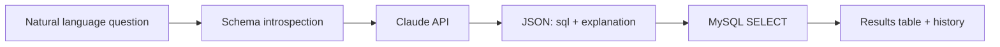

# Text to SQL AI

Ask questions about your data in plain English and get back runnable SQL plus a result table — powered by **Claude** and a realistic **e-commerce demo database**.

Built with **Laravel 13** as a portfolio project to explore natural-language analytics: schema-aware prompting, safe read-only execution, and a simple UI for iterating on questions.

---

## What it does

You type a question like *“Which categories have more than five products?”* The app:

1. **Introspects** the MySQL schema (tables, columns, foreign keys, sample rows).
2. **Sends** that context and your question to the Anthropic Messages API.
3. **Parses** a structured JSON response containing the generated `SELECT` and a short explanation.
4. **Runs** the query against the database and renders the rows in the browser.

Earlier questions are saved so you can revisit SQL and results without re-running the model.



---

## Tech stack

| Layer | Choices |
|--------|---------|
| Backend | PHP 8.3, Laravel 13 |
| AI | Anthropic Claude (Messages API) |
| Database | MySQL 8 |
| Frontend | Blade, Tailwind CSS 4, DaisyUI, Vite, jQuery (AJAX) |

---

## Example questions

Try prompts like these against the seeded store:

- Top 5 products by total order amount
- Products that have never been ordered
- Monthly revenue for the last 12 months
- Categories with more than 2 products

---

## How generation works (code map)

| Piece | Role |
|--------|------|
| `PromptService` | Builds schema text from `information_schema` + sample rows |
| `ClaudeRepository` | System prompt (JSON output, SELECT-only, LIMIT rules) |
| `ClaudeService` | HTTP call to Anthropic Messages API |
| `TextToSqlController` | Validates input, runs SQL, stores `Question`, returns HTML partials |

Configuration lives in `config/ai.php` (model, token limits, database metadata).

---

## Project structure

```
app/
  Http/Controllers/TextToSqlController.php
  Services/ClaudeService.php, PromptService.php
  Repositories/ClaudeRepository.php
database/
  migrations/          # store schema + questions table
  seeders/TechStoreSeeder.php
resources/views/
  text-to-sql.blade.php
  text-to-sql/partials/
```

---

## License

MIT — see [LICENSE](LICENSE) if present, or use the same terms as your Laravel app skeleton.
