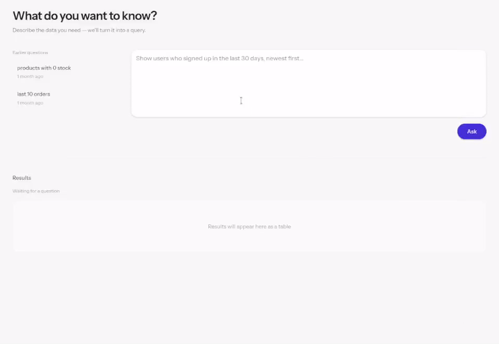

# Text to SQL AI

A Laravel application that turns plain-English questions about an electronics store into SQL and displays the results.

**Live demo:** [text-to-sql-ai.on-forge.com](https://text-to-sql-ai.on-forge.com)

A question such as “Which categories have more than five products?” returns a `SELECT` statement, a short explanation, and a result table. Previous questions are kept in a sidebar and can be reopened without another model call. Submitting the same history entry again updates that record. Individual entries can be deleted.

## How it works

This application provides the form, the result view, and question history. SQL generation and execution are handled by [memo2k/asksql](https://github.com/memo2k/asksql).

On each question, the package:

1. Reads the MySQL schema, including tables, columns, foreign keys, and sample rows.
2. Sends that schema and the question to Claude.
3. Receives a `SELECT` statement and a short explanation.
4. Validates that the SQL is a single read-only statement.
5. Executes the query and returns the rows.

The application then renders the table and stores the question.

Framework tables (`users`, `migrations`, `cache`, `jobs`, and similar) are excluded from schema introspection. The `questions` history table is excluded as well, through `ASKSQL_EXCLUDED_TABLES=questions`, so it is not exposed to the model.

## Demo database

The included database models a small electronics shop:

- **Catalog:** categories, products, and attributes such as brand, RAM, and storage
- **Sales:** customers, orders, and order line items

Example questions:

- Top 5 products by total order amount
- Products that have never been ordered
- Monthly revenue for the last 12 months
- Categories with more than 2 products

## Tech stack

- PHP 8.4, Laravel 13, MySQL 8
- [memo2k/asksql](https://github.com/memo2k/asksql)
- Blade, Tailwind CSS 4, DaisyUI, Vite, and jQuery (AJAX)

## Limits

AskSQL accepts only a single `SELECT` or `WITH … SELECT` statement. Write operations, multiple statements, and references to system schemas are rejected. Result sets are capped by `ASKSQL_MAX_ROWS` (default 1000).

`POST /` is rate-limited per IP by `ASKSQL_QUERIES_PER_HOUR` (30 in `.env.example`). `DELETE /delete-question` is limited to 10 requests per minute per IP. Questions are limited to 2000 characters.

## Configuration

`ANTHROPIC_API_KEY` is required. AskSQL ships its own configuration, so this application does not publish `config/asksql.php`.

Optional variables in `.env.example`:

- `ANTHROPIC_MODEL`
- `ANTHROPIC_MAX_TOKENS`
- `ASKSQL_MAX_ROWS`
- `ASKSQL_QUERIES_PER_HOUR`
- `ASKSQL_EXCLUDED_TABLES=questions`

## License

MIT
